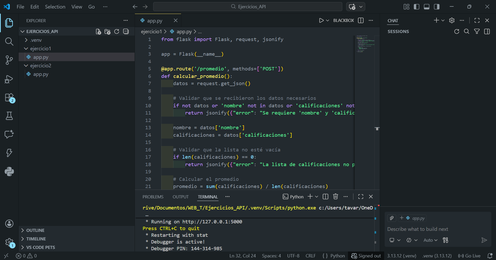
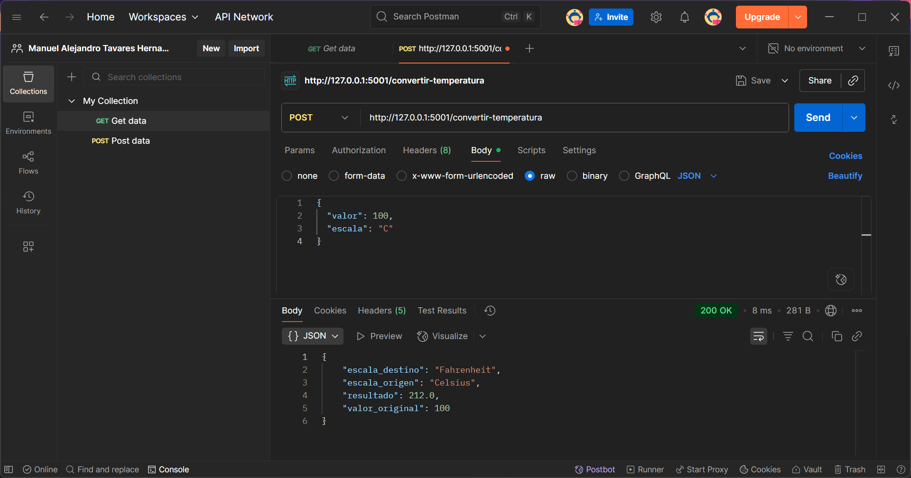

# 3.9 Ejercicios de API con Python y Flask

Desarrollo de APIs REST utilizando el microframework Flask de Python. Se implementaron dos endpoints funcionales que procesan datos en formato JSON y devuelven respuestas estructuradas.

---

## Tecnologías utilizadas

- Python 3
- Flask
- Postman (pruebas)

---

## Ejercicio 1 — API de Promedio de Calificaciones

Endpoint `POST /promedio` que recibe el nombre de un estudiante y una lista de calificaciones, calcula el promedio y devuelve el resultado en JSON.


### Evidencia — Prueba en Postman



---

## Ejercicio 2 — API Conversor de Temperaturas

Endpoint `POST /convertir-temperatura` que convierte temperaturas entre Celsius y Fahrenheit aplicando la fórmula correspondiente según la escala de origen.

### Fórmulas utilizadas

| Conversión | Fórmula |
|---|---|
| Celsius → Fahrenheit | `F = (C × 9/5) + 32` |
| Fahrenheit → Celsius | `C = (F − 32) × 5/9` |


### Evidencia — Prueba en Postman



---

## Estructura del repositorio

```
3.9-Ejercicios-de-API/
│
├── ejercicio1/
│   ├── app.py
│   └── README.md
│
├── ejercicio2/
│   ├── app.py
│   └── README.md
│
├── ejercicio1.png
├── ejercicio2.png
├── promedio.png
├── convertir_temperaturas.png
└── README.md
```

---

Los servidores estarán disponibles en:
- Ejercicio 1: `http://127.0.0.1:5000`
- Ejercicio 2: `http://127.0.0.1:5001`
